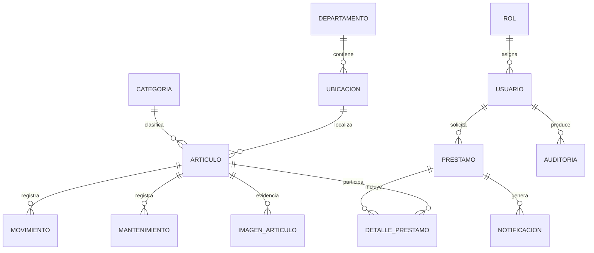

# Modelo fisico Oracle

```mermaid
erDiagram
  ROL ||--o{ USUARIO : asigna
  DEPARTAMENTO ||--o{ UBICACION : contiene
  CATEGORIA ||--o{ ARTICULO : clasifica
  UBICACION ||--o{ ARTICULO : localiza
  ARTICULO ||--o{ IMAGEN_ARTICULO : evidencia
  USUARIO ||--o{ PRESTAMO : solicita
  PRESTAMO ||--o{ DETALLE_PRESTAMO : incluye
  ARTICULO ||--o{ DETALLE_PRESTAMO : participa
  ARTICULO ||--o{ MANTENIMIENTO : registra
  ARTICULO ||--o{ MOVIMIENTO : registra
  PRESTAMO ||--o{ NOTIFICACION : genera
  USUARIO ||--o{ AUDITORIA : produce
```
